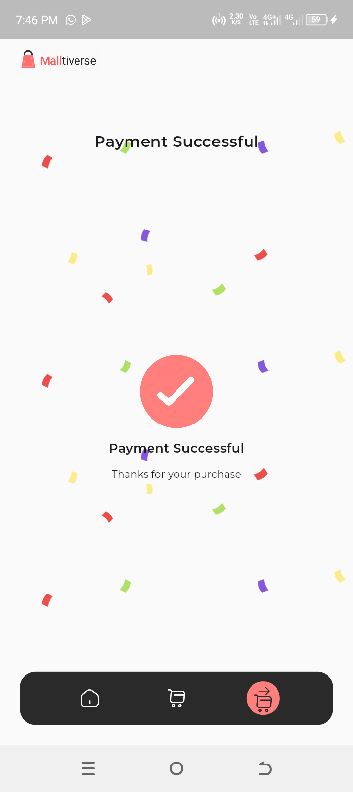
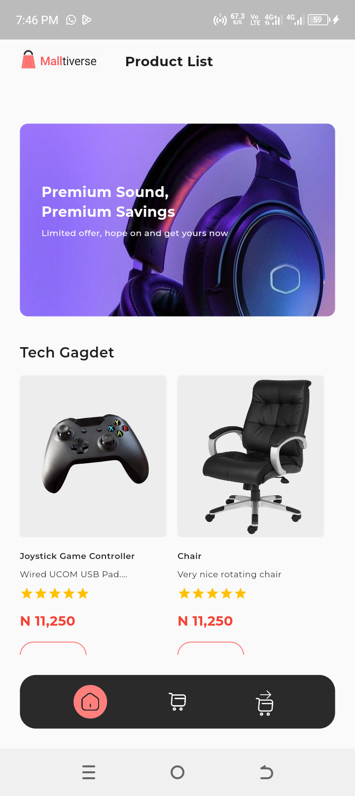
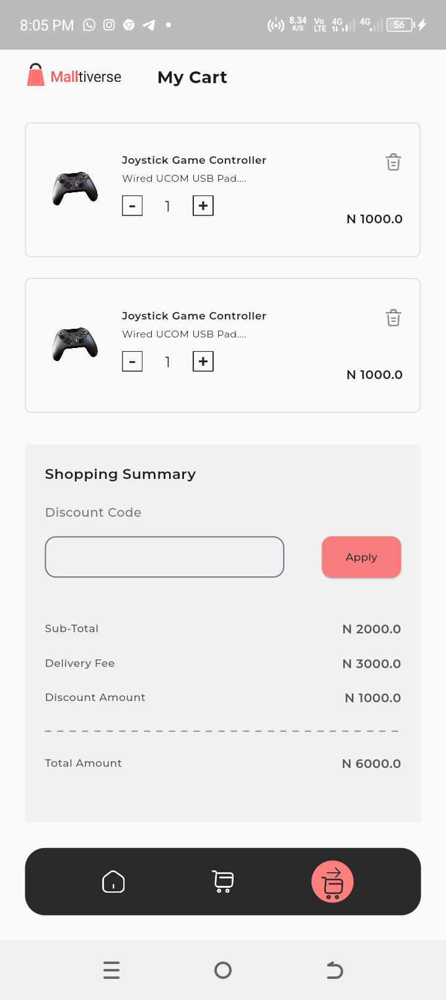

# HNG Task 3

This app is an implementation of a simple shopping app design with figma. It retrieves listed products from Timbu API.

- **Usage:**
1. All Products: Displays list of products
2. Cart Items: Save items to cart
3. Payment: Mimicks payment gateway

## Features
- Product listing
- Cart items
- Checkout
- Simulated payment
- Success page

## Installation

Follow these steps to set up the project locally:

1. **Clone the repository:**

   git clone https://github.com/Damigrace1/HNG-task-2.git

   cd hngtask3

2. **Install Flutter dependencies**
   flutter pub get

3. **Run the app**
   flutter run

## Screenshots

1. **Products List**
   
   
   

- **Appetize Link:** (https://appetize.io/app/b_qgsleqquctpdjpw5mjbk7xuep4).
- **APK Download:** (https://drive.google.com/file/d/1nYypYeAk6vp4uvr3fhR3hFPpPbIqzCOL/view?usp=drivesdk).
- **Contact Information:**
- **Name**:`Damilare Ogunwehin`
- **Slack Username**:`White Developer`
- **Email**:`whitedeveloper1@gmail.com`
- **GitHub**:(https://github.com/Damigrace1/HNG-task-2)

